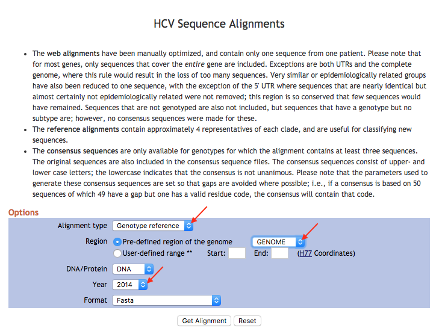

# HCV References

## 1. Download HCV references sequences from LANL

The [Los Alamos HCV Database](https://hcv.lanl.gov/) is used to obtain reference sequences.
LANL has [ready-made alignments](https://hcv.lanl.gov/content/sequence/NEWALIGN/align.html)
available for download at the above link. We will download two alignments: a web alignment
from 2008 containing one sequence per patient, and a genotype reference from 2014 that we
will use to identify the subtypes of our samples.

The fields of interest are *Alignment type*, *Region*, and *Year*.



For the web alignment, select *Web Alignment*, *GENOME*, and *2008*.
Save the downloaded file as `HCV_ALL_2008_genome_DNA.fasta` within the `HCV/references/LANL` directory.

For the genotype reference, select *Genotype reference*, *GENOME*, and *2014*.
Save the downloaded file as `HCV_REF_2014_genome_DNA.fasta` in the same directory.


## 2. Extract subset of references

The strategy we will use for identifying the subtype of each sample is to compare
sequences from the sample to a reference database containing one representative from
each subtype. The downloaded file contains multiple sequences for each subtype, so here
we are going to extract a subset of the sequences for building the database.

I have already selected the IDs that I want in a file called  `ids.txt`.
The following script selects the sequences and creates a FASTA file:

```python
from Bio import SeqIO
import re

"""
Load all sequences in FASTA file into a dictionary with the sequence ID as the key
"""
seqs = {}
for s in SeqIO.parse('LANL/HCV_REF_2014_genome_DNA.fasta','fasta'):
    seqs[s.id] = s

"""
Extract the genotype consensus sequences to HCV_genotype_consensus.fasta
"""
gtnames = [k for k in seqs.keys() if k.endswith('CONSENSUS')]
gtnames.sort(key=lambda x:x.split('.')[1])
with open('HCV_genotype_consensus.fasta', 'w') as outh:
    for rn in gtnames:
        seqstr = str(seqs[rn].seq)
        seqstr = seqstr.replace('-', '').upper()
        seqstr = re.sub('\?','N', seqstr)        
        id = '%s' % rn.split('.')[1].split('(')[0].split('_')[0]
        id = 'HCV_%s.con' % id[-1]
        print >>outh, '>%s' % id
        for i in range(0,len(seqstr),100):
            print >>outh, seqstr[i:i+100]

"""
Extract the subtype consensus sequences to HCV_subtype_consensus.fasta
"""
connames = [k for k in seqs.keys() if k.split('.')[1].startswith('CON')]
connames.sort(key=lambda x:x.split('.')[1].split('(')[0])
with open('HCV_subtype_consensus.fasta', 'w') as outh:
    for rn in connames:
        seqstr = str(seqs[rn].seq)
        seqstr = seqstr.replace('-', '').upper()
        seqstr = re.sub('\?','N', seqstr)
        id = 'HCV_%s.con' % rn.split('.')[1].split('(')[0].split('_')[1]
        print >>outh, '>%s' % id
        for i in range(0,len(seqstr),100):
            print >>outh, seqstr[i:i+100]

"""
Extract one sequence from each subtype (from ids.txt) to HCV_subtype_refs.fasta.
Also, write each sequence within its own file in the "subtypes" directory
"""
refnames = [l.strip() for l in open('ids.txt','r')]
refnames.sort(key=lambda x: x.split('.')[1].lower())
with open('HCV_subtype_refs.fasta', 'w') as outh:
    for rn in refnames:
        seqstr = str(seqs[rn].seq)
        seqstr = seqstr.replace('-', '').upper()
        seqstr = re.sub('\?','N', seqstr)
        id = 'HCV_%s' % rn.split('.')[1].lower()
        id = '%s.%s' % (id, rn.split('.')[-1])
        print >>outh, '>%s' % id
        for i in range(0,len(seqstr),100):
            print >>outh, seqstr[i:i+100]        
        with open('subtypes/%s.fasta' % id, 'w') as outs:
            print >>outs, '>%s' % id
            for i in range(0,len(seqstr),100):
                print >>outs, seqstr[i:i+100]
```

There should be three fasta files in the current directory: 
`HCV_genotype_consensus.fasta`, `HCV_subtype_consensus.fasta`, and
`HCV_subtype_refs.fasta`. There should also be one `*.fasta` file for
each subtype in the `subtypes` directory.

## 3. Index references

Some software programs require special "index" files in order to use sequence files.
Here we are going to prebuild indexes used by different programs. This
builds the `novoalign`, `samtools` and `picard` indexes.

```bash
module load viral-ngs
for f in *.fasta; do
    read_utils.py novoindex $f
    read_utils.py index_fasta_samtools $f
    read_utils.py index_fasta_picard $f
done

for f in subtypes/*.fasta; do
    read_utils.py novoindex $f
    read_utils.py index_fasta_samtools $f
    read_utils.py index_fasta_picard $f
done
```

Here we build the `blast+` indexes.

```bash
module load blast+
for f in *.fasta; do
    makeblastdb -in $f -dbtype nucl -out ${f%.*}
done

for f in subtypes/*.fasta; do
    makeblastdb -in $f -dbtype nucl -out ${f%.*}
done
```

Finally, we build `bowtie2` indexes:

```bash
module load bowtie2
for f in *.fasta; do
    bowtie2-build $f ${f%.*}
done

for f in subtypes/*.fasta; do
    bowtie2-build $f ${f%.*}
done
```
