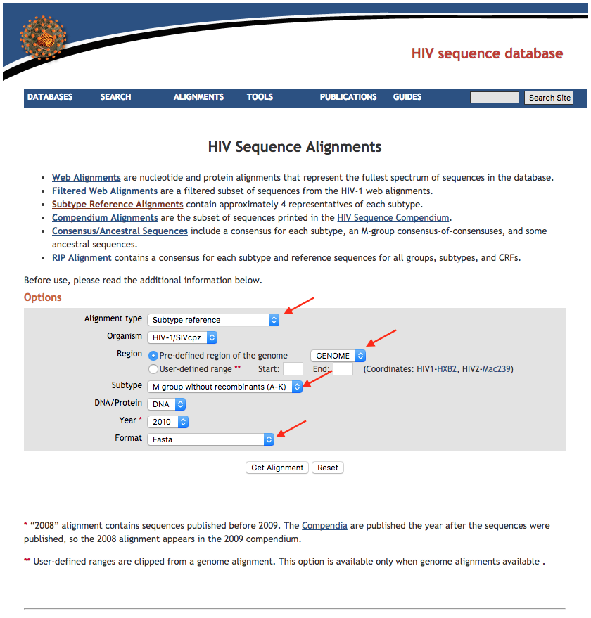

# HIV References

## 1. Download HIV references sequences from LANL

The [Los Alamos HIV Database](https://hiv.lanl.gov/) is used to obtain reference sequences.
LANL has [curated alignments](https://www.hiv.lanl.gov/content/sequence/NEWALIGN/align.html)
available for download at the above link. We will download complete **genomes** for the 
**subtype references** from **2014** and use this to identify the subtypes of our samples.
We will also download complete **genomes** for **consensus/ancestral** sequences from **2002**.

The fields of interest are *Alignment type*, *Region*, and *Year*.



For the subtype reference, select *Subtype reference*, *GENOME*, and *2010*.
Save the downloaded file as `HIV1_REF_2010_genome_DNA.fasta` in the `LANL` directory.

For the consensus reference, select *Consensus/Ancestral*, *GENOME*, and *2002*.
Save the downloaded file as `HIV1_CON_2002_genome_DNA.fasta` in the `LANL` directory.


## 2. Extract subset of references

The strategy we will use for identifying the subtype of each sample is to compare
sequences from the sample to a reference database containing one representative from
each subtype. The downloaded file contains multiple sequences for each subtype, so here
we are going to extract a subset of the sequences for building the database.

We have already selected the IDs in a file called  `ids.txt`.
The following script selects the sequences and creates a FASTA file:

```python
from Bio import SeqIO
import re

"""
Load all sequences in FASTA file into a dictionary with the sequence ID as the key
"""
seqs = {}
for s in SeqIO.parse('LANL/HIV1_REF_2010_genome_DNA.fasta','fasta'):
    seqs[s.id] = s

"""
Extract one sequence from each subtype (from ids.txt) to HIV_subtype_refs.fasta.
Also, write each sequence within its own file in the "subtypes" directory
"""
refnames = [l.strip() for l in open('ids.txt','r')]
refnames.sort(key=lambda x: x.split('.')[1].lower())
with open('HIV_subtype_refs.fasta', 'w') as outh:
    for rn in refnames:
        seqstr = str(seqs[rn].seq)
        seqstr = seqstr.replace('-', '').upper()
        seqstr = re.sub('\?','N', seqstr)
        id = 'HIV_%s' % rn.split('.')[1].upper()
        id = '%s.%s' % (id, rn.split('.')[-1])
        print >>outh, '>%s' % id
        for i in range(0,len(seqstr),100):
            print >>outh, seqstr[i:i+100]        
        with open('subtypes/%s.fasta' % id, 'w') as outs:
            print >>outs, '>%s' % id
            for i in range(0,len(seqstr),100):
                print >>outs, seqstr[i:i+100]
```

We will also create references for the consensus sequences.

```python
from Bio import SeqIO
import re

"""
Load all sequences in FASTA file into a dictionary with the sequence ID as the key
"""
seqs = {}
for s in SeqIO.parse('LANL/HIV1_CON_2002_genome_DNA.fasta','fasta'):
    seqs[s.id] = s

"""
Extract the subtype consensus sequences to HIV_subtype_consensus.fasta
"""
connames = ['CONSENSUS_%s' % st for st in ['A1','A2','B','C','D','F1','G','H','O']]
with open('HIV_subtype_consensus.fasta', 'w') as outh:
    for rn in connames:
        seqstr = str(seqs[rn].seq)
        seqstr = seqstr.replace('-', '').upper()
        seqstr = re.sub('\?','N', seqstr)
        id = 'HIV_%s.con' % rn.split('_')[1]
        print >>outh, '>%s' % id
        for i in range(0,len(seqstr),100):
            print >>outh, seqstr[i:i+100]

```

There should be two fasta files in the current directory: 
`HIV_subtype_consensus.fasta`, and `HIV_subtype_refs.fasta`.
There should also be one `*.fasta` file for
each subtype in the `subtypes` directory.

## 3. Index references

Some software programs require special "index" files in order to use sequence files.
Here we are going to prebuild indexes used by different programs. This
builds the `novoalign`, `samtools` and `picard` indexes.

```bash
module load viral-ngs
for f in *.fasta; do
    read_utils.py novoindex $f
    read_utils.py index_fasta_samtools $f
    read_utils.py index_fasta_picard $f
done

for f in subtypes/*.fasta; do
    read_utils.py novoindex $f
    read_utils.py index_fasta_samtools $f
    read_utils.py index_fasta_picard $f
done
```

Here we build the `blast+` indexes.

```bash
module load blast+
for f in *.fasta; do
    makeblastdb -in $f -dbtype nucl -out ${f%.*}
done

for f in subtypes/*.fasta; do
    makeblastdb -in $f -dbtype nucl -out ${f%.*}
done
```

Finally, we build `bowtie2` indexes:

```bash
module load bowtie2
for f in *.fasta; do
    bowtie2-build $f ${f%.*}
done

for f in subtypes/*.fasta; do
    bowtie2-build $f ${f%.*}
done
```
